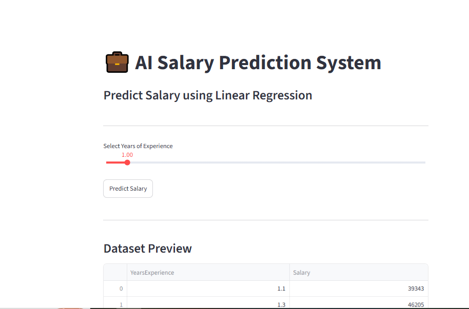
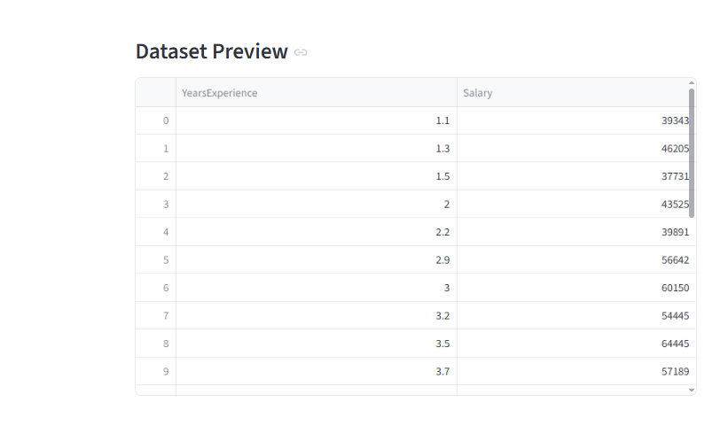
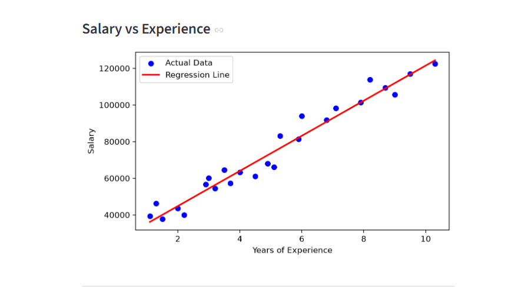

# 💰 AI Salary Prediction System

An AI-powered Salary Prediction System that predicts an estimated salary based on years of experience using Machine Learning and Linear Regression.

## 🚀 Project Overview

## 🖥️ Application Preview

### Salary Prediction Streamlit App





This project uses Machine Learning to analyze the relationship between years of professional experience and salary.

The trained Linear Regression model predicts the expected salary for a given number of years of experience.

The project also includes an interactive Streamlit web application where users can enter their experience and get a salary prediction instantly.

## 🎯 Objectives

- Predict salary using years of experience.
- Apply Linear Regression for prediction.
- Perform Exploratory Data Analysis (EDA).
- Visualize salary and experience relationships.
- Build an interactive Streamlit application.
- Save and reuse the trained Machine Learning model.

## 🛠️ Technologies Used

- Python
- Pandas
- NumPy
- Matplotlib
- Scikit-learn
- Jupyter Notebook
- Streamlit
- Joblib

## 📂 Project Structure

```text
AI-Salary-Prediction-System/
│
├── app.py
├── salary_data.csv
├── salary_model.pkl
├── Train_model.ipynb
├── EDA_Salary_Prediction.ipynb
├── project_synopsis.pdf
├── requirements.txt
├── README.md
└── .gitignore
